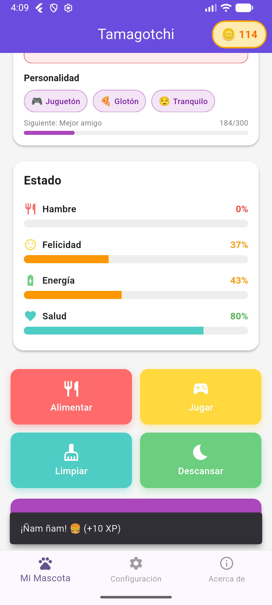
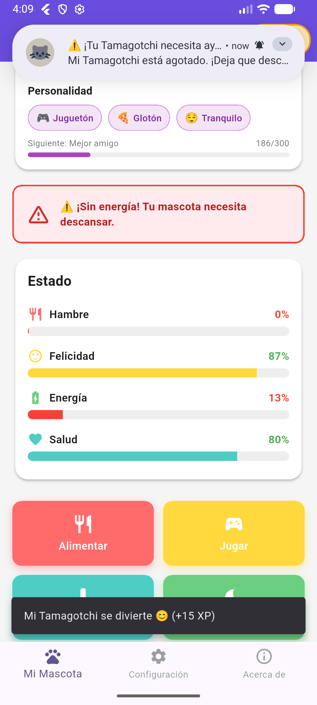
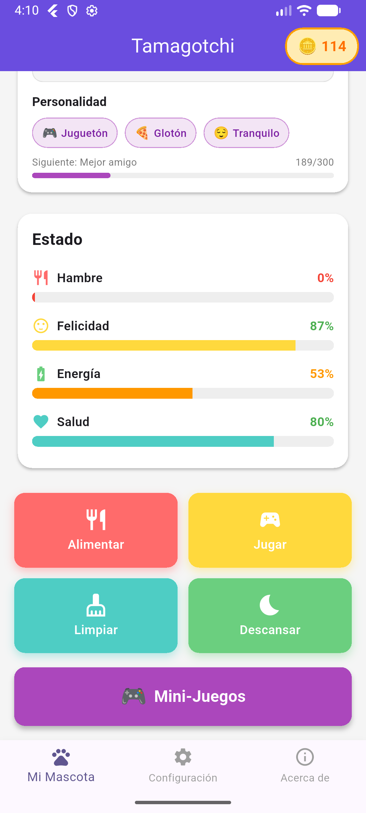
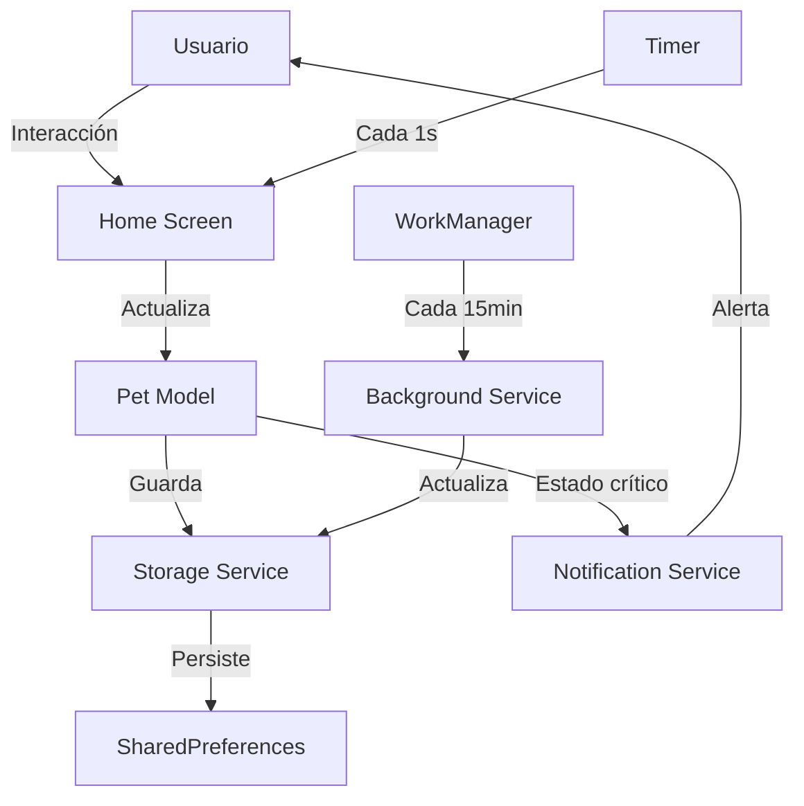

<div align="center">

# 🐾 Tamagotchi Virtual

### Una mascota virtual completa desarrollada en Flutter

[](https://flutter.dev)
[](https://dart.dev)
[](https://flutter.dev)
[](LICENSE)

[Características](#-características) • [Instalación](#-instalación) • [Uso](#-uso) • [Documentación](#-documentación) • [Créditos](#-créditos)

</div>

---

## 📖 Descripción

**Tamagotchi Virtual** es una aplicación móvil desarrollada en Flutter que recrea la experiencia clásica de cuidar una mascota virtual. Con un sistema completo de evolución, personalización y procesamiento en background, tu mascota vive 24/7 incluso cuando la app está cerrada.

Este proyecto implementa mecánicas modernas de gamificación incluyendo:
- Sistema de evolución con 5 etapas de vida
- Experiencia y niveles
- Procesamiento en background real con WorkManager
- Notificaciones inteligentes
- Persistencia completa de estado

## 📋 Tabla de Contenidos

- [Características](#-características)
- [Demo](#-demo)
- [Instalación](#-instalación)
- [Uso](#-uso)
- [Arquitectura](#-arquitectura)
- [Tecnologías](#-tecnologías)
- [Estado del Proyecto](#-estado-del-proyecto)
- [Documentación](#-documentación)
- [Roadmap](#-roadmap)
- [Contribuir](#-contribuir)
- [Créditos](#-créditos)
- [Licencia](#-licencia)
- [Contacto](#-contacto)

## ✨ Características

### 🎮 Cuidado Virtual Completo

- **4 Acciones de Cuidado**: Alimentar 🍔, Jugar 🎮, Limpiar 🧼, Descansar 😴
- **Métricas en Tiempo Real**: Hambre, Felicidad, Energía y Salud que decaen continuamente
- **Estados de Ánimo Dinámicos**: 6 estados diferentes (Feliz, Triste, Hambriento, Cansado, Normal, Crítico)
- **Animaciones Fluidas**: Botones animados y avatar con efecto de "respiración"

### 🐣 Sistema de Evolución

- **5 Etapas de Vida**: Huevo 🥚 → Bebé 🐣 → Niño 🐥 → Adolescente 🐤 → Adulto 🐦
- **Sistema de Experiencia**: Gana XP por cada acción de cuidado
- **Niveles Progresivos**: Sistema de nivelación exponencial con barra de progreso
- **3 Variantes de Adulto**: Evoluciona en Descuidado 💀, Normal 🐦 o Excelente 🦅 según tu cuidado
- **Celebración de Evolución**: Diálogo especial cada vez que tu mascota evoluciona
- **Evolución Dual**: Basada en experiencia O tiempo (lo que ocurra primero)

### 🎮 Sistema de Mini-Juegos

- **3 Mini-Juegos Jugables**: Memory 🧠, Sliding Puzzle 🧩, Reaction Race ⚡
- **Sistema de Monedas**: Gana monedas 🪙 jugando mini-juegos
- **Recompensas Dinámicas**: XP y monedas según tu rendimiento
- **Estadísticas Completas**: Tracking de partidas, victorias, récords y más
- **Memory Game**: Encuentra 8 parejas de emojis en un grid 4x4
- **Sliding Puzzle**: Ordena números del 1-8 en un rompecabezas deslizante 3x3
- **Reaction Race**: 10 rondas de velocidad - presiona cuando cambie a verde
- **Balance de Recompensas**: Hasta 8x más XP que acciones normales

### 💾 Persistencia y Background

- **Persistencia Total**: SharedPreferences guarda todo el estado entre sesiones
- **Background 24/7**: WorkManager ejecuta tareas cada 15 minutos incluso con la app cerrada
- **Cálculo Retroactivo**: Al reabrir, calcula métricas basadas en tiempo transcurrido
- **Lifecycle Management**: Manejo correcto de estados de app (pausa, resume, cierre)

### 🧠 IA Adaptativa

- **Personalidad Única**: Tu mascota desarrolla 12 traits de personalidad según tu cuidado
- **Estados Emocionales**: 8 estados emocionales dinámicos (de Extasiado a Ansioso)
- **Sistema de Vínculo**: 5 niveles de relación (Desconocido → Alma gemela)
- **Mensajes Contextuales**: La mascota se comunica según su personalidad y estado
- **Sugerencias Inteligentes**: Recomendaciones basadas en análisis del estado actual
- **Respuestas Adaptativas**: Cada acción genera respuestas únicas según la personalidad
- **Historial de Interacciones**: Tracking completo para análisis de patrones
- **Predicción de Necesidades**: El sistema anticipa cuándo necesitará atención

### 🔥 Firebase Integration

- **Firebase Crashlytics**: Monitoreo automático de crashes y errores en producción
- **Reportes Detallados**: Stack traces completos con información de dispositivo
- **Manejo de Errores**: Captura de errores fatales, asíncronos y en zonas de ejecución
- **Logging Contextual**: Información personalizada para debugging efectivo

### 🔔 Notificaciones Inteligentes

- **Alertas Críticas**: Notificaciones cuando tu mascota necesita atención urgente
- **Permisos Dinámicos**: Solicitud de permisos en tiempo de ejecución
- **Contextuales**: Mensajes específicos según el estado (hambre, cansancio, salud baja)

### 🎨 Personalización

- **8 Colores Disponibles**: Púrpura, Rosa, Azul, Verde, Naranja, Rojo, Teal, Ámbar
- **5 Accesorios**: Sombrero 🎩, Corona 👑, Gafas 🕶️, Lazo 🎀, Sin accesorio
- **Renombrar Mascota**: Dale un nombre único a tu compañero virtual
- **Configuración de Sonido**: Habilitar/deshabilitar haptic feedback

### ✨ UX y Pulido

- **Haptic Feedback**: Vibración táctil diferenciada para cada acción
- **Onboarding Interactivo**: Tutorial de 5 pasos para nuevos usuarios
- **3 Pantallas**: Cuidado, Configuración y Acerca de
- **Material Design 3**: Interfaz moderna siguiendo las guías de diseño de Google
- **Animaciones Contextuales**: Feedback visual inmediato en cada interacción

## 🎥 Demo

### Capturas de Pantalla

<div align="center">

| Pantalla Principal | Cuidado de la Mascota | Mini-Juegos |
|:------------------:|:---------------------:|:-----------:|
|  |  |  |

| Sistema de IA | Configuración |
|:-------------:|:-------------:|
|  |  |

</div>

### Características Visuales

- **Interfaz moderna** con Material Design 3
- **Animaciones fluidas** en todas las interacciones
- **Sistema de evolución visual** con 5 etapas distintas
- **Personalización completa** de colores y accesorios
- **Mini-juegos interactivos** con música de fondo
- **IA adaptativa** que responde según la personalidad de tu mascota

## 📥 Instalación

### Requisitos Previos

- **Flutter SDK**: 3.10.4 o superior
- **Dart SDK**: 3.0 o superior
- **Android Studio** o **VS Code** con extensiones de Flutter
- **Dispositivo Android** (físico o emulador) con Android 5.0+ (API 21+)
- **iOS** (opcional): Xcode 14+ y dispositivo iOS 12+

### Pasos de Instalación

1. **Clonar el repositorio**
   ```bash
   git clone https://github.com/tu-usuario/tamagotchi.git
   cd tamagotchi
   ```

2. **Instalar dependencias**
   ```bash
   flutter pub get
   ```

3. **Verificar configuración de Flutter**
   ```bash
   flutter doctor
   ```

4. **Ejecutar en modo debug**
   ```bash
   # Android
   flutter run

   # iOS (solo en macOS)
   flutter run -d ios
   ```

5. **Compilar release (Android)**
   ```bash
   flutter build apk --release
   # El APK se genera en: build/app/outputs/flutter-apk/app-release.apk
   ```

### Dependencias Principales

```yaml
dependencies:
  flutter:
    sdk: flutter

  # Persistencia
  shared_preferences: ^2.2.2

  # Background Processing
  workmanager: ^0.5.1

  # Notificaciones
  flutter_local_notifications: ^16.3.0
  permission_handler: ^11.1.0

  # UX
  vibration: ^2.0.0
  introduction_screen: ^3.1.14

  # Navegación
  cupertino_icons: ^1.0.6
```

## 🚀 Uso

### Primera Ejecución

1. Al abrir la app por primera vez, verás un **onboarding interactivo** de 5 pasos
2. Se te solicitarán **permisos de notificación** (recomendado aceptar)
3. Tu mascota comenzará como un **Huevo 🥚** (Etapa 1)
4. Realiza acciones de cuidado para ganar experiencia y ayudarla a evolucionar

### Acciones de Cuidado

| Acción | Efecto | XP |
|--------|--------|-----|
| 🍔 **Alimentar** | Reduce hambre -30 | +10 XP |
| 🎮 **Jugar** | Aumenta felicidad +25, reduce energía -15 | +15 XP |
| 🧼 **Limpiar** | Aumenta salud +20 | +10 XP |
| 😴 **Descansar** | Aumenta energía +40 | +5 XP |

### Sistema de Evolución

#### Por Experiencia (Rápido)
- **Bebé** (🐣): 100 XP (~10 acciones de jugar)
- **Niño** (🐥): 500 XP (~33 acciones adicionales)
- **Adolescente** (🐤): 1500 XP (~67 acciones adicionales)
- **Adulto** (🐦): 3000 XP (~100 acciones adicionales)

#### Por Tiempo (Automático)
- **Bebé**: 5 minutos desde nacimiento
- **Niño**: 30 minutos de vida
- **Adolescente**: 2 horas de vida
- **Adulto**: 6 horas de vida

### Variantes de Adulto

Tu mascota evolucionará en diferentes formas según tu cuidado:

- **Excelente** 🦅: Promedio de métricas > 70 (requiere atención constante)
- **Normal** 🐦: Promedio de métricas 40-70 (cuidado regular)
- **Descuidado** 💀: Promedio de métricas < 40 (advertencia visual)

### Personalización

1. Ve a la pestaña **⚙️ Configuración**
2. Selecciona un **color** (8 opciones disponibles)
3. Elige un **accesorio** (5 opciones)
4. **Renombra** tu mascota tocando el botón de edición
5. Activa/desactiva **sonido** y **notificaciones**

## ⚡ Comandos Rápidos

El proyecto incluye comandos y scripts para facilitar el desarrollo:

### Makefile (Recomendado)

```bash
make help           # Ver todos los comandos disponibles
make setup          # Setup inicial completo
make run            # Ejecutar app en modo debug
make test           # Ejecutar tests
make build-release  # Build APK release
```

### Scripts Bash

```bash
./scripts/dev.sh help      # Script principal de desarrollo
./scripts/test.sh all      # Suite completa de tests
./scripts/build.sh release # Build con verificaciones
```

**📖 Documentación completa de comandos:** [COMANDOS.md](COMANDOS.md)

---

## 🏗️ Arquitectura

### Estructura del Proyecto

```
lib/
├── config/
│   └── theme.dart              # Tema y colores de la app
├── models/
│   ├── pet.dart                # Modelo principal de la mascota
│   ├── life_stage.dart         # Etapas de vida y evolución
│   ├── pet_preferences.dart    # Preferencias de personalización
│   └── credit_model.dart       # Modelo para créditos
├── screens/
│   ├── home_screen.dart        # Pantalla principal de cuidado
│   ├── settings_screen.dart    # Configuración y personalización
│   ├── about_screen.dart       # Información de la app
│   ├── credits_screen.dart     # Créditos del proyecto
│   ├── onboarding_screen.dart  # Tutorial inicial
│   └── main_navigation.dart    # Navegación por pestañas
├── services/
│   ├── storage_service.dart       # Persistencia con SharedPreferences
│   ├── background_service.dart    # WorkManager para background
│   ├── notification_service.dart  # Sistema de notificaciones
│   ├── preferences_service.dart   # Gestión de preferencias
│   ├── feedback_service.dart      # Haptic feedback
│   └── local_service.dart         # Servicios locales
├── widgets/
│   ├── pet_display.dart           # Widget de visualización de mascota
│   ├── metric_bar.dart            # Barras de métricas
│   └── animated_action_button.dart # Botones animados
├── utils/
│   └── constants.dart          # Constantes de la app
└── main.dart                   # Punto de entrada
```

### Flujo de Datos



### Patrones de Diseño

- **State Management**: StatefulWidget con setState
- **Service Layer**: Capa de servicios para lógica de negocio
- **Model Layer**: Modelos inmutables con copyWith
- **Singleton Pattern**: Servicios como singletons
- **Observer Pattern**: Temporizadores y listeners de lifecycle

## 🛠️ Tecnologías

### Frontend
- **Flutter 3.10.4+**: Framework principal de UI
- **Dart 3.0+**: Lenguaje de programación
- **Material Design 3**: Sistema de diseño

### Backend & Persistencia
- **SharedPreferences**: Almacenamiento local clave-valor
- **WorkManager**: Procesamiento en background (Android)
- **Firebase Core**: Plataforma de servicios en la nube
- **Firebase Crashlytics**: Monitoreo y reporte de errores

### Notificaciones
- **flutter_local_notifications**: Notificaciones locales
- **permission_handler**: Gestión de permisos

### UX & Feedback
- **vibration**: Feedback háptico
- **introduction_screen**: Onboarding

### Herramientas de Desarrollo
- **flutter_launcher_icons**: Generación de iconos
- **flutter_native_splash**: Splash screen nativo

## 📊 Estado del Proyecto

### Fases Completadas ✅

| Fase | Descripción | Estado |
|------|-------------|--------|
| **Fase 1** | Estructura base y UI | ✅ Completada |
| **Fase 2** | Interacciones básicas | ✅ Completada |
| **Fase 3** | Persistencia de estado | ✅ Completada |
| **Fase 4** | Temporizadores en tiempo real | ✅ Completada |
| **Fase 5** | Background processing | ✅ Completada |
| **Fase 6** | Sistema de notificaciones | ✅ Completada |
| **Fase 7** | Personalización | ✅ Completada |
| **Fase 8** | Pulido y UX | ✅ Completada |
| **Fase 9** | Evolución y Ciclos de Vida | ✅ Completada |
| **Fase 10** | Mini-Juegos | ✅ Completada |
| **Fase 11** | IA Adaptativa | ✅ Completada |

**Total: 62 tareas completadas** 🎉

### Próximas Mejoras (Opcionales)

- [ ] **Fase 12**: Realidad Aumentada (ARCore/ARKit)
- [ ] **Fase 13**: Características Sociales (compartir, visitas)

## 📚 Documentación

Cada fase implementada incluye documentación técnica detallada:

### Documentación por Fase

- 📄 [**FASE_3_PERSISTENCIA.md**](FASE_3_PERSISTENCIA.md) - Sistema de guardado y carga
- 📄 [**FASE_4_TEMPORIZADORES.md**](FASE_4_TEMPORIZADORES.md) - Actualización en tiempo real
- 📄 [**FASE_5_BACKGROUND.md**](FASE_5_BACKGROUND.md) - Procesamiento en segundo plano
- 📄 [**FASE_6_NOTIFICACIONES.md**](FASE_6_NOTIFICACIONES.md) - Sistema de notificaciones
- 📄 [**FASE_7_PERSONALIZACION.md**](FASE_7_PERSONALIZACION.md) - Personalización completa
- 📄 [**FASE_8_PULIDO_UX.md**](FASE_8_PULIDO_UX.md) - Animaciones y feedback
- 📄 [**FASE_9_EVOLUCION.md**](FASE_9_EVOLUCION.md) - Sistema de evolución
- 📄 [**FASE_10_MINIJUEGOS.md**](FASE_10_MINIJUEGOS.md) - Mini-juegos y sistema de monedas
- 📄 [**FASE_11_IA_ADAPTATIVA.md**](FASE_11_IA_ADAPTATIVA.md) - Sistema de IA adaptativa

### Guías Adicionales

- 📄 [**ROADMAP.md**](ROADMAP.md) - Hoja de ruta completa del proyecto
- 📄 [**COMANDOS.md**](COMANDOS.md) - Guía completa de comandos y scripts
- 📄 [**COMO_PROBAR_PERSISTENCIA.md**](COMO_PROBAR_PERSISTENCIA.md) - Guía de pruebas
- 📄 [**ESTRUCTURA_INICIAL.md**](ESTRUCTURA_INICIAL.md) - Estructura del proyecto
- 📄 [**FIREBASE_CRASHLYTICS.md**](FIREBASE_CRASHLYTICS.md) - Integración de Firebase Crashlytics

## 🗺️ Roadmap

```
✅ Q4 2024 - Fases 1-6: MVP Funcional
✅ Q4 2024 - Fases 7-9: Personalización y Evolución
✅ Q1 2025 - Fase 10: Mini-Juegos
✅ Q1 2025 - Fase 11: IA Adaptativa
📅 Q2 2025 - Fase 12: Realidad Aumentada
📅 Q3 2025 - Fase 13: Social Features
```

## 🤝 Contribuir

Las contribuciones son bienvenidas. Por favor:

1. Fork el proyecto
2. Crea una rama para tu feature (`git checkout -b feature/AmazingFeature`)
3. Commit tus cambios (`git commit -m 'Add some AmazingFeature'`)
4. Push a la rama (`git push origin feature/AmazingFeature`)
5. Abre un Pull Request

### Guías de Contribución

- Seguir las convenciones de código de Dart/Flutter
- Documentar funciones públicas
- Agregar tests cuando sea aplicable
- Actualizar documentación relevante

## 👥 Créditos

### Desarrollado por

**Facultad de Estudios Superiores Iztacala**
**Universidad Nacional Autónoma de México (UNAM)**

### Equipo de Desarrollo

Este proyecto fue desarrollado como parte de las actividades académicas de FES Iztacala.

### Tecnologías Principales

- [Flutter](https://flutter.dev) - Framework de desarrollo
- [Dart](https://dart.dev) - Lenguaje de programación

### Agradecimientos

- Comunidad de FES Iztacala
- Equipo de desarrollo de Flutter
- Contribuidores del proyecto
- Comunidad open source de Flutter

Para más información sobre los créditos, consulta la sección **"Acerca de"** dentro de la aplicación.

## 📄 Licencia

Este proyecto está bajo la Licencia MIT. Ver el archivo [LICENSE](LICENSE) para más detalles.

```
MIT License

Copyright (c) 2024 FES Iztacala, UNAM

Permission is hereby granted, free of charge, to any person obtaining a copy
of this software and associated documentation files (the "Software")...
```

## 📞 Contacto

**FES Iztacala - UNAM**

- 🌐 [Sitio Web Oficial](https://www.iztacala.unam.mx/)
- 📱 [Portal de Noticias](https://noticias.iztacala.unam.mx/)
- 📧 Email: apps@iztacala.unam.mx

## 🔗 Referencias

### Inspiración y Recursos

- [Flutter Documentation](https://docs.flutter.dev/)
- [Background Processing in Flutter](https://pub.dev/packages/workmanager)
- [Flutter Local Notifications](https://pub.dev/packages/flutter_local_notifications)
- [Building Virtual Pet Apps](https://medium.com/@flutter-guides)

### Proyectos Relacionados

- [MikuDatchi](https://github.com/wesleydevsouza/) - Tamagotchi de Hatsune Miku en Flutter
- [Flutter Games](https://flutter.dev/games) - Recursos oficiales de Flutter para juegos

---

<div align="center">

**Hecho con ❤️ en Flutter**

[](https://flutter.dev)
[](https://www.iztacala.unam.mx/)

[⬆ Volver arriba](#-tamagotchi-virtual)

</div>
